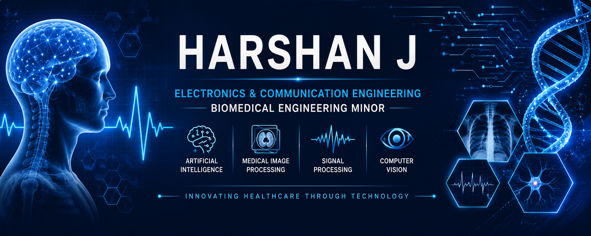

  

<h1 align="center">Hi 👋, I'm Harshan J</h1>

<h3 align="center">
Electronics & Communication Engineering Undergraduate | Biomedical Engineering Minor
</h3>

Passionate about building intelligent healthcare technologies through Biomedical Engineering, Artificial Intelligence, Medical Image Processing, Signal Processing and Computer Vision.

## 🚀 About Me
🎓 B.Tech Electronics & Communication Engineering @ Alliance University
🩺 Biomedical Engineering Minor
🔬 Interested in AI for Healthcare
📷 Medical Image Processing
📈 Biomedical Signal Processing
🤖 Computer Vision
💻 MATLAB • Python • OpenCV
🌱 Currently exploring Deep Learning and Embedded AI

## 🧠 Research Interests
- Biomedical AI
- Medical Imaging
- Physiological Signal Processing
- Embedded Healthcare Devices
- Computer Vision
- Machine Learning
  
## 🛠 Tech Stack
## 🛠️ Tech Stack

### 💻 Programming Languages

---

### 🔬 Domains of Interest

## 📫 Connect
📧 hrshnyadava@gmail.com
💼 LinkedIn:
www.linkedin.com/in/harshanj05

⭐ Always learning. Always building.
